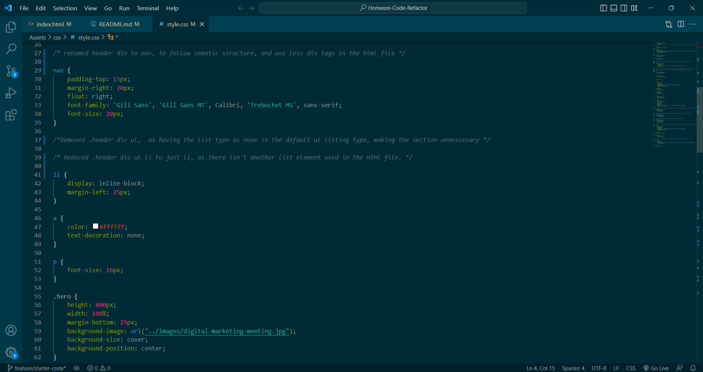
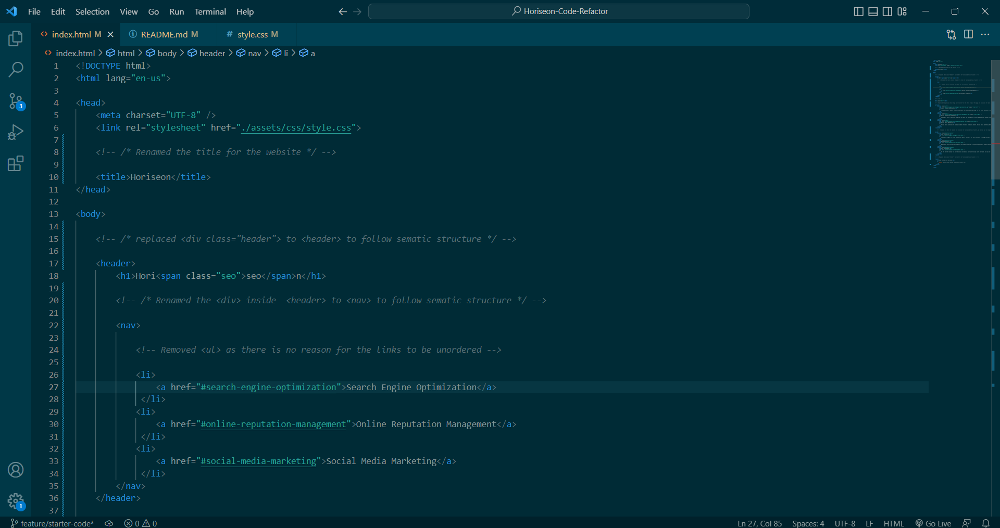

# Horiseon-Code-Refactor

## Description

This project is a Code refactor for the Horiseon website. While the website was able to funtion as intended, the HTML and CSS needed some cleaning up, getting rid of extra and unnessesary lines of code, as well as restructuring the HTML to follow sematic structure. While working on this refactor, I solidified my understanding on sematic structure which I was struggling to understand before. 

## Installation

Download or pull the Repository from github, and use VS code to look at the html and CSS for the Horiseon code Refactor

## Usage 

Some some screenshots of the code of both CSS and HTML, as well as screenshots of what the site should look like when launched.
A link to the website is also included

